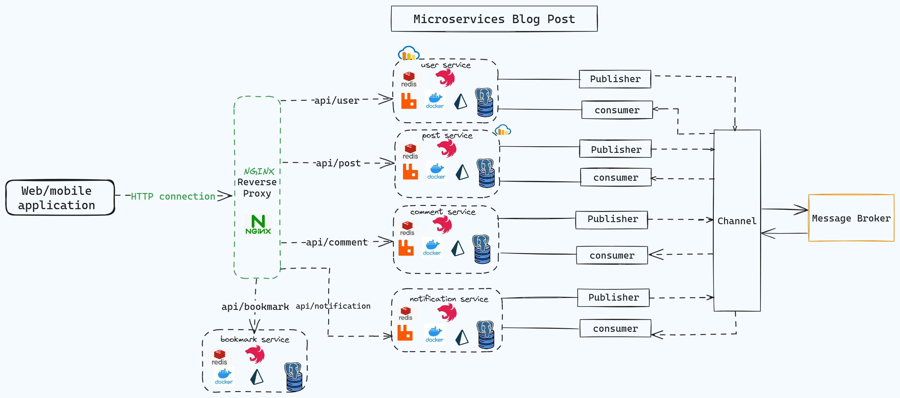

# Microservices Blog Post

## Tech

- Node.js
- Nest.js
- PostgreSQL/Prisma
- Redis
- RabbitMQ
- NGINX
- Docker
- Jest/Superset

## System Architecture



## Overview

Blog post app with monorepo architecture that's divided into 5 microservices.

## User service

- This service responsible of the main User (CRUD) operations.
    - Authentication
        - User can signup and login through this service.
    - User profile
        - Retrieve and update profile
    - User profile image
        - Upload and Delete image to/from cloud (cloudinary)
    - Follow management
        - create follow
        - unfollow
        - get followers
        - get following users

## Post service

- This service responsible of the main Post (CRUD) operations.
    - Post management
        - create post with uploading image (cloudinary) or without
        - Timeline : get all posts
        - Get user posts
        - Get / Delete / Update post by id
    - Reaction management
        - create reaction (like / dislike)
        - delete reaction (like / dislike)

## Comment service

- This service responsible of the main Comment (CRUD) operations.
    - Comment Management
        - Create Comment
        - Get / Delete / Update comment by id

## Notification service

- This service responsible of the main Notification (CRUD) operations, and here is where the message queue work
    - Notification Management
        - Get User Notifications
        - Mark Notification as seen
        - **User Registration welcome notification**
        - **New Post Creation notification**
        - **New Comment Creation notification**
        - **New Reaction (LIKE) creation notification**

## Bookmark service

- This service responsible of the main Bookmark (CRUD) operations.
    - Bookmark Management
        - Create Bookmark (Save the whole post)
        - Get / Delete  Bookmark by id

## libs/common

in this library I share  database , cloud , message broker services , logging middleware and Authentication Functionality to all the services with Dependency injection

## Authentication

- Users are authenticated using JWTs and passport, where a token is created when a user logs-in with valid credentials. Passwords are also encrypted using Argon.
- **JWT Strategy Configuration**: The `JwtStrategy` class extends Passport's `Strategy` to extract and validate JWT tokens from the Authorization header of incoming requests. It uses a secret key stored in environment variables for validation.
- **JWT Token Generation**: When a user logs in, their credentials are validated. If valid, a JWT token is generated and returned to the user. This token can be used to access protected routes by including it in the Authorization header of subsequent requests.

## Database

- The server use PostgreSQL with Prisma as an ORM
- All the Prisma services share to all services on the same Database

## cloud service

- Cloudinary Service
    - Upload images to cloud
    - Delete images from cloud

## Message Broker

- **Communication**
    - Microservices communicates with each other using RabbitMQ via publisher and subscriber.
    - Each microservice is deployed into a docker container.
- Services
    - **User Registration**
        - **User Service** publishes a `user.created` message when a new user registers.
        - **Notification Service** listens for `user.created` messages and sends a welcome notification.
        
        ### 3. **New Post Creation**
        
        - **Post Service** publishes a `post.created` message when a new post is created.
        - **Notification Service** listens for `post.created` messages and notifies followers.
        
        ### **New Comment**
        
        - **Comment Service** publishes a `comment.created` message when a new comment is made.
        - **Notification Service** listens for `comment.created` messages to notify users that make comment on the same post that there is another comment
        
        ### 7. **New Reaction (LIKE)**
        
        - **post Service** publishes a `reaction.created` message when a new LIKE is added.
        - **Notification Service** listens for `reaction.created` messages to notify users that follow the person who like the post that the post is liked by him

## Caching

- Redis is used as a caching Interceptor for the GET endpoints. The middleware defines the Redis key using the URL of the route, then the middleware returns the cached data if available, otherwise, the request proceeds to the controller, where the key passed from the middleware gets assigned to a value.
.png)

## Server security

- Done by using Helmet , helmet can help protect app from some well-known web vulnerabilities by setting HTTP headers appropriately. Generally, Helmet is just a collection of smaller middleware functions that set security-related HTTP headers

## **Request Rate Limiting**

- A common technique to protect applications from brute-force attacks is **rate-limiting by using @nestjs/throttler and** `ttl: 60000` milliseconds

## **Validation**

- Done with ValidationPipe and class-validator and class-transformer in Nest.js

The `ValidationPipe` makes use of the powerful class-validator package and its declarative validation decorators. The `ValidationPipe` provides a convenient approach to enforce validation rules for all incoming client payloads, where the specific rules are declared with simple annotations in local class/DTO declarations in each module.

## **Logging**

- All requests can be logged using Logger in Nest.js with the name of request with data and status of response and response time

## API documentation

- Each service has it’s own secure Swagger API docs endpoints ‘api/docs’
- postman collection found in ```docs folder```

## **Reverse Proxy**

- Nginx is used as a reverse proxy to send requests to each microservice. It routes incoming requests from `/servicename` the service's port `servicename:port`.


## **Docker**

- Each microservice is deployed into a docker container.
- Each service has a Docker image. All images are deployed into containers managed through the docker-compose file, which contains PostgreSQL , RabbitMQ , Redis and NGINX .
- Docker commands found in ```dockerREADME.md``` file

## Installation

```bash
$ npm install
```

## Running the app (local)
- Make sure to have Node.js version +16 , Nest.js , PostgreSQL , Redis , RabbitMQ and NGINX local in your machine 
- Make sure to add a .env file in the root , you can check the .env_template file for a reference.

## Database with PostgreSQL & prisma

```
npx prisma generate 
npx prisma db push
npx prisma studio
``` 

## Nest apps
```bash
# watch mode
$ npm run start:dev #(service name) (default is user service)
# run user service
npm run start:dev
# run post service
npm run start:dev post
# run comment service
npm run start:dev comment
# run bookmark service
npm run start:dev bookmark
# run notification service
npm run start:dev notification

```


## Test
- Make sure to add .env.test in the root

```bash
# unit tests
$ npm run test

# e2e tests (user service only)
$ npm run test:e2e

$ npx dotenv -e .env.test prisma db push
```

## Running the app (with Docker)
You can spin up all services used by running/building the docker-compose file:

```
docker-compose up --build
```

## License

Nest is [MIT licensed](LICENSE).
